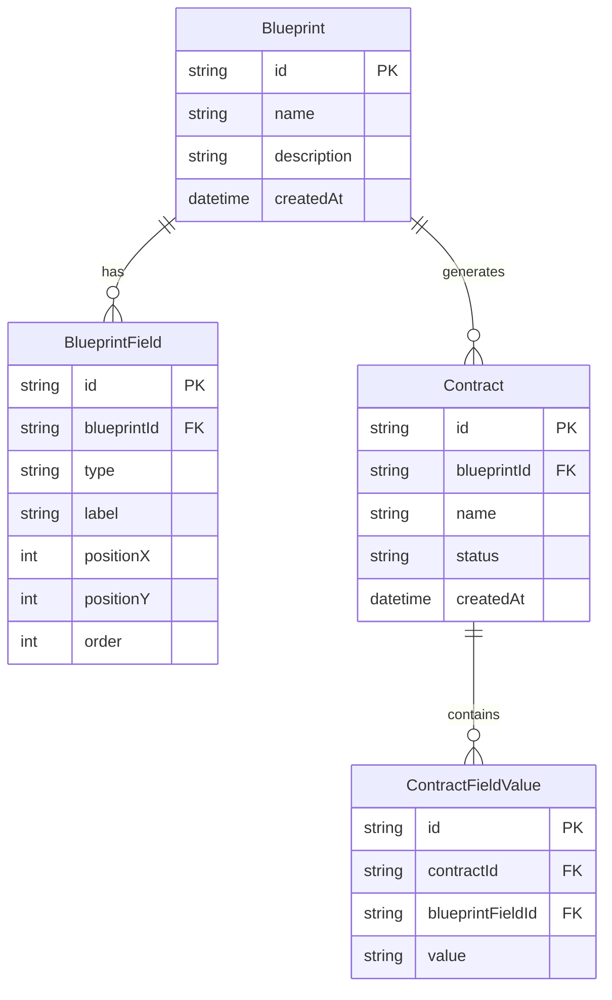

# Contract Management Platform

A full-stack Contract Management Platform built with Next.js 16, featuring blueprint templates, contract creation, and lifecycle management with strict state enforcement.


## 🚀 Quick Start

### Prerequisites
- Node.js 18+ 
- npm or yarn

### Installation

```bash
# Clone the repository
git clone <repository-url>
cd contract-management-system

# Install dependencies
npm install

# Initialize the database
npx prisma db push

# Start development server
npm run dev
```

Open [http://localhost:3000](http://localhost:3000) in your browser.

## 📋 Features

### Blueprint Management
- Create reusable contract templates
- Supported field types: **Text**, **Date**, **Signature**, **Checkbox**
- Each field stores type, label, and position
- Blueprints cannot be modified once contracts exist

### Contract Creation
- Select from existing blueprints
- Fill in field values during creation
- Contracts inherit all blueprint fields

### Lifecycle Management
Contracts follow a strict lifecycle with enforced transitions:

```
Created → Approved → Sent → Signed → Locked
    ↓         ↓        ↓
  Revoked  Revoked  Revoked
```

- **Created**: Initial state, editable
- **Approved**: Approved by reviewer
- **Sent**: Sent to signee
- **Signed**: Signed by signee
- **Locked**: Final, immutable state
- **Revoked**: Cancelled, terminal state

### Dashboard
- Contract statistics (Total, Active, Signed)
- Filterable contracts table (All, Active, Pending, Signed)
- Quick actions for lifecycle transitions
- Blueprint count

## 🏗️ Architecture

### Tech Stack

| Layer | Technology | Justification |
|-------|------------|---------------|
| Frontend | Next.js 16 (App Router) | Full-stack React framework with server components |
| Backend | Next.js API Routes | RESTful API in same codebase |
| Database | SQLite + Prisma | Simple setup, relational model, type-safe ORM |
| Styling | TailwindCSS 4 | Utility-first CSS, rapid development |
| Language | TypeScript | Type safety across frontend and backend |

### Project Structure

```
contract-management-system/
├── app/
│   ├── api/
│   │   ├── blueprints/        # Blueprint CRUD endpoints
│   │   └── contracts/         # Contract + lifecycle endpoints
│   ├── blueprints/            # Blueprint pages
│   ├── contracts/             # Contract pages
│   ├── page.tsx               # Dashboard
│   └── layout.tsx             # Root layout with sidebar
├── components/                 # Reusable UI components
├── lib/
│   ├── db.ts                  # Prisma client singleton
│   ├── lifecycle.ts           # State machine logic
│   └── types.ts               # TypeScript definitions
├── prisma/
│   └── schema.prisma          # Database schema
└── package.json
```

### Database Schema



## 🔌 API Reference

### Blueprints

| Method | Endpoint | Description |
|--------|----------|-------------|
| GET | `/api/blueprints` | List all blueprints |
| POST | `/api/blueprints` | Create blueprint |
| GET | `/api/blueprints/:id` | Get blueprint by ID |
| PUT | `/api/blueprints/:id` | Update blueprint |
| DELETE | `/api/blueprints/:id` | Delete blueprint |

### Contracts

| Method | Endpoint | Description |
|--------|----------|-------------|
| GET | `/api/contracts` | List contracts (with ?filter=) |
| POST | `/api/contracts` | Create contract from blueprint |
| GET | `/api/contracts/:id` | Get contract details |
| PUT | `/api/contracts/:id` | Update field values |
| POST | `/api/contracts/:id/transition` | Transition status |
| GET | `/api/contracts/:id/transition` | Get allowed transitions |

### Request/Response Examples

**Create Blueprint:**
```json
POST /api/blueprints
{
  "name": "Employment Agreement",
  "description": "Standard employment contract",
  "fields": [
    { "type": "text", "label": "Employee Name", "positionX": 0, "positionY": 0, "order": 0 },
    { "type": "date", "label": "Start Date", "positionX": 0, "positionY": 1, "order": 1 },
    { "type": "signature", "label": "Employee Signature", "positionX": 0, "positionY": 2, "order": 2 }
  ]
}
```

**Transition Contract:**
```json
POST /api/contracts/:id/transition
{
  "targetStatus": "approved"
}
```

**Error Response (Invalid Transition):**
```json
{
  "success": false,
  "error": "Invalid transition from 'created' to 'locked'. Allowed transitions: approved, revoked"
}
```

## ⚙️ Design Decisions & Trade-offs

### Decisions Made

1. **SQLite over PostgreSQL**: Chosen for simpler setup and zero external dependencies. Suitable for demo/development; can easily swap to PostgreSQL by changing the Prisma datasource.

2. **Monorepo Architecture**: Frontend and backend in same Next.js project for simpler deployment and shared types.

3. **Field Values as String**: All field values stored as strings for simplicity. Checkbox values are "true"/"false" strings.

4. **No Authentication**: Marked optional in requirements. User shown is mocked.

5. **Lifecycle in Backend Only**: State machine logic enforced server-side to prevent client-side bypasses.

### Assumptions

- Single user/admin role (no multi-tenancy)
- Field positions track x/y for potential drag-and-drop but UI uses simple ordering
- Signatures are typed names (not drawn signatures)
- Contracts are immutable once locked

## 🧪 Testing

### Manual Testing Flow

1. **Create Blueprint**: Navigate to Blueprints → New Blueprint → Add fields → Save
2. **Create Contract**: Navigate to Contracts → New Contract → Select blueprint → Fill values → Create
3. **Test Lifecycle**:
   - Click Approve → status changes to "Approved"
   - Click Send → status changes to "Sent"
   - Click Sign → status changes to "Signed"
   - Click Lock → status changes to "Locked" (no more actions)
4. **Test Invalid Transitions**: Try Revoke on a Locked contract (should fail)

### Verify API Validation

```bash
# Should fail - missing fields
curl -X POST http://localhost:3000/api/blueprints \
  -H "Content-Type: application/json" \
  -d '{"name": "Test"}'

# Should fail - invalid transition
curl -X POST http://localhost:3000/api/contracts/:id/transition \
  -H "Content-Type: application/json" \
  -d '{"targetStatus": "locked"}'
```

## 📁 File Overview

### Core Files

| File | Purpose |
|------|---------|
| `lib/lifecycle.ts` | State machine with valid transitions |
| `lib/types.ts` | TypeScript interfaces and enums |
| `lib/db.ts` | Prisma client singleton |
| `prisma/schema.prisma` | Database models |

### API Routes

| File | Endpoints |
|------|-----------|
| `app/api/blueprints/route.ts` | GET, POST blueprints |
| `app/api/blueprints/[id]/route.ts` | GET, PUT, DELETE blueprint |
| `app/api/contracts/route.ts` | GET, POST contracts |
| `app/api/contracts/[id]/route.ts` | GET, PUT contract |
| `app/api/contracts/[id]/transition/route.ts` | POST, GET transitions |

### Pages

| Page | Route |
|------|-------|
| Dashboard | `/` |
| Blueprint List | `/blueprints` |
| Create Blueprint | `/blueprints/new` |
| Blueprint Detail | `/blueprints/:id` |
| Contract List | `/contracts` |
| Create Contract | `/contracts/new` |
| Contract Detail | `/contracts/:id` |

## 📦 Production Build

```bash
# Build for production
npm run build

# Start production server
npm start
```

## 🔮 Future Enhancements

- [ ] User authentication and roles (approver vs signer)
- [ ] PDF export of contracts
- [ ] Email notifications on status changes
- [ ] Audit trail / history log
- [ ] Drag-and-drop field positioning
- [ ] Digital signature with canvas drawing
- [ ] Docker deployment setup

## 📄 License

MIT
